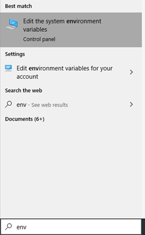
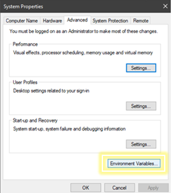
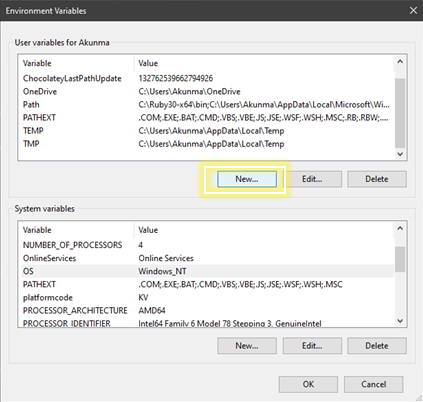
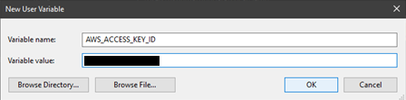
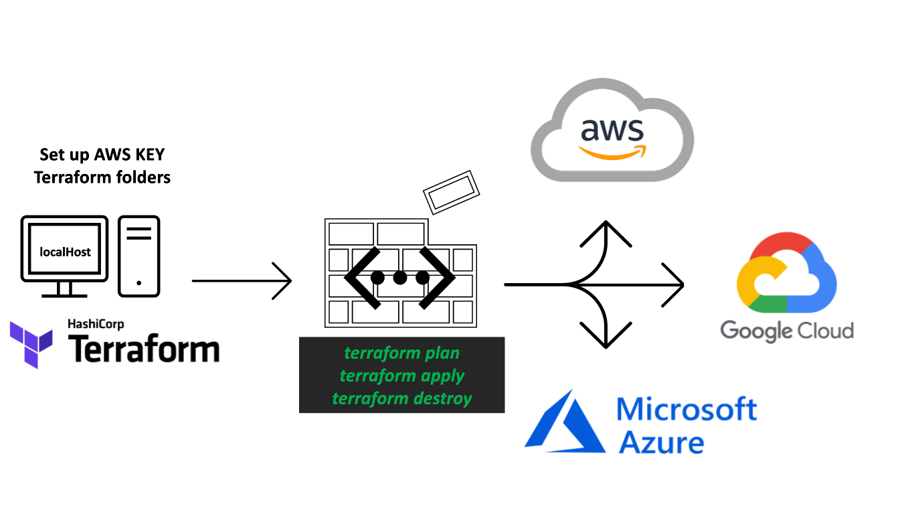

# Infastructure as Code Using Terraform 


# Terraform Orchestration
## What is Terraform?

Orchestration tool, better for setting up network infrastructu and spinning up machines using a cloud service provider
Building infrastructure an a crucial part of creating a system. 
- Itegration testing
- Scripting

## Why Terraform?


Building and updating infrastructure is much easier and quicker

config management - ansible
service orchestration - terraform

Recommended to learn both Terraform and Anisible as companues may prefer one ver the other.
Terraform is a much more simple program to use, and Anisible requires more resources.
Terraform is lightwieght but not agentless
Terraform is an automation tool, (one file can create a VPC, instance, auto-scaling group and load balancer)

## Setting Up Terraform

### Installation of Terraform and Chocolaty

You can download the binary from the following link:
https://www.terraform.io/downloads.html 
When you have unzipped the binary file, there's no installer.

After downloading, you should move the file to `/usr/local/bin` directory and set the Path as an environment variable if necessary.

**For Windows**, install `Chocolaty` and follow the instructions on the page: <br>
https://chocolatey.org/install

We can also install it using chocolatey package managers:
```
Set-ExecutionPolicy Bypass -Scope Process -Force; [System.Net.ServicePointManager]::SecurityProtocol = [System.Net.ServicePointManager]::SecurityProtocol -bor 3072; iex ((New-Object System.Net.WebClient).DownloadString('https://community.chocolatey.org/install.ps1'))
```
Open `PowerShell` in `Admin mode` by right clicking on the application and select **Open as Administrator**

Paste the copied text into your shell and press Enter.

Wait a few seconds for the command to complete.

If you don't see any errors, you are ready to use Chocolatey! Type choco or choco -? now, or see 
Getting Started for usage instructions.

Install Terraform: `choco install terraform`

Check installation: `terraform --version`

Should see below outcome if everything went well:
`Terraform v1.0.?`

<br>

### Main Commands
```bash
Main commands:
  init          Prepare your working directory for other commands
  validate      Check whether the configuration is valid
  plan          Show changes required by the current configuration
  apply         Create or update infrastructure
  destroy       Destroy previously-created infrastructure

All other commands:
  console       Try Terraform expressions at an interactive command prompt
  fmt           Reformat your configuration in the standard style
  force-unlock  Release a stuck lock on the current workspace
  get           Install or upgrade remote Terraform modules
  graph         Generate a Graphviz graph of the steps in an operation
  import        Associate existing infrastructure with a Terraform resource
  login         Obtain and save credentials for a remote host
  logout        Remove locally-stored credentials for a remote host
  output        Show output values from your root module
  providers     Show the providers required for this configuration
  refresh       Update the state to match remote systems
  show          Show the current state or a saved plan
  state         Advanced state management
  taint         Mark a resource instance as not fully functional
  test          Experimental support for module integration testing
  untaint       Remove the 'tainted' state from a resource instance
  version       Show the current Terraform version
  workspace     Workspace management

Global options (use these before the subcommand, if any):
  -chdir=DIR    Switch to a different working directory before executing the
                given subcommand.
  -help         Show this help output, or the help for a specified subcommand.
  -version      An alias for the "version" subcommand.
  ```

## Securing the AWS Keys for Terraform

### Ceating an Env Variable

### 1. 


### 2. 


### 3. 


### 4. 



Repeat these steps for the **AWS_SECRECT_ACCESS_KEY**

## Creating Resources on AWS

### Setting Up App Instance using Terraform

- The two environment variables have just been created
- We now need to restart the terminal
- Create file called main.tf - this is where the EC2 instance will e built
- Add this code to initialise terraform with provider AWS:

```
provider "aws" {

    region = "eu-west-1"
}
```
- Run this code with `terraform init`

Let's start with launching an EC2 instance using the app AMI.
We will need:
- AMI ID
- `sre_key.pem` file
- AWS keys setup is already done
- Public IP
- Type of instance `t2.micro`

Add to the `main.tf` file the information from the AMI:

```
resource "aws_instance" "app_instance" {
    ami = "ami-IDNUMBER"
    instance_type = "t2.micro"
    associate_public_ip_address = true
    tags = {
        Name = "sre_akunma_terraform_app"
    }
}
```
In the terminal, enter `terraform plan` then `terraform apply` to start up the instance.

## Creating and Setting Up a VPC - *Scripting*



(Desciption and context)

<br>

We are creating a new VPC from AWS using Terraform. The steps are nearly identical to the ones in the `AWS_VPC_Networking` repo.

### 1.  Create a VPC with CIDR block
```
resource "aws_vpc" "sre_akunma_vpc_tf" {
    cidr_block = "10.101.0.0/16"
    tags = {
        Name = "sre_akunma_vpc_tf"
    }
}
```

### 2. Run `terraform plan` then `terraform apply` - the VPC should now be running

### 3. Create a `variable.tf` file and place in the VPC ID 
  - Get VPC ID from AWS **or** from terraform logs
```
variable "vpc_id" {
    default = "vpc-IDNUMBER"
}
```

### 4. Create internet gateway and attach the IG to the VPC
```
resource "aws_internet_gateway" "sre_akunma_tf_ig" {
    vpc_id = var.vpc_id
    tags = {
        Name = "sre_akunma_tf_ig"
    }
}
```
  - Create a variable for the internet gateway ID, for future use
```
variable "ig_id" {
    default = "igw-IDNUMBER"
}
```

### 5. Create public subnet for `10.101.1.0/24`:
```
resource "aws_subnet" "sre_akunma_tf_sub" {
    vpc_id = var.vpc_id
    cidr_block = "10.101.1.0/24"
     map_public_ip_on_launch = "true"
    tags = {
        Name = "sre_akunma_tf_sub"
    }
}
```
And make a variable:
```
variable "aws_pub_subnet" {
    default = "subnet-IDNUMBER"
}
```

### 6. Create the route table
```
resource "aws_route_table" "sre_akunma_tf_rt" {
    vpc_id = var.vpc_id
    route = []
    tags = {
        Name = "sre_akunma_tf_rt"
    }
}
```
Edit route and insert your IG
```
resource "aws_route" "r" {
    route_table_id = var.rt_id
    destination_cidr_block = "0.0.0.0/0"
    gateway_id = var.ig_id
}
```
Associate public subnet with route table
```
resource "aws_route_table_association" "pub" {
    subnet_id = var.aws_pub_subnet
    route_table_id = var.rt_id
}
```
Add to `variable.tf` for the route table
```
variable "rt_id"{
    default = "rtb-IDNUMBER"
}
```

### 7. Create a Security Group for our app
```
resource "aws_security_group" "app_group" {
    name = "sre_akunma_tf_sg"
    description = "Security group for app"
    vpc_id = var.vpc_id
    # Inbound rules
    ingress {
        description = "From my IP"
        from_port = 22
        to_port = 22
        protocol = "tcp"
        cidr_blocks = ["YOUR IP"]
    }
    ingress {
        description = "Allow Port 3000"
        from_port = 3000
        to_port = 3000
        protocol = "TCP"
        cidr_blocks = ["0.0.0.0/0"]
    }
    ingress{
        description = "Public Access"
        from_port = 80
        to_port = 80
        protocol = "TCP"
        cidr_blocks = ["0.0.0.0/0"]
        ipv6_cidr_blocks = ["::/0"]
    }
    # Outbound rules
    egress {
        from_port = 0
        to_port = 0
        protocol = "-1"
        cidr_blocks = ["0.0.0.0/0"]
        ipv6_cidr_blocks = ["::/0"]
    }
    tags = {
        Name = "sre_akunma_tf_sg"
    }
}
```
Add this as a variable
```
variable "sg_id" {
    default = "sg-IDNUMBER"
}
```

### 8. In `variable.tf`, add the name and path of the key used to set up the app
```
variable "aws_key_name" {
    default = "NAME"
}

variable "aws_key_path" {
    default = "~/.ssh/NAME.pem"
}
```

### 9. Add code for starting up the EC2 instance in `main.tf`
```
resource "aws_instance" "app_instance" {
    ami = var.webapp_ami_id
    subnet_id = var.aws_pub_subnet
    instance_type = "t2.micro"
    associate_public_ip_address = true
    tags = {
        Name = "sre_akunma_tf_app"
    }
    vpc_security_group_ids = [var.sg_id]
    key_name = var.aws_key_name
    connection {
        type = "ssh"
        user = "ubuntu"
        private_key = var.aws_key_path
        host = "${self.associate_public_ip_address}"
    }
}
```

### After each step, `terraform plan` and `terraform apply` to see the changes exectuted

(The `terraform.tfstate.backup` file can help when looking for an object and its attributes. Rather than using the `variable.tf` file to recall stored values of an object, use `terraform.tfstate.backup` to find out what attributes can be referenced in the code)

## Adding MongoDB to the System

### 1.  Create a private subnet for the DB


### 2. Add new private subnet to route table


### 3. Create a new Security Group for the DB


### 4. Lauch instance


## Load Balancing

(Description and context)

<br>

Add steps in `main.tf` to automate setting up the load balancer and auto-scaling group

**Tasks:**

- create load balancer 
- attach to ig 
- internet faceing 
- listen to port 80 0-65355 3000 
- 22 for ip
- write script for this

### 1. Create a launch configuration

```
resource "aws_launch_configuration" "app_launch_configuration" {
    name = "sre_akunma_tf_lc"
    image_id = var.webapp_ami_id
    instance_type = "t2.micro"
}
```

Make a variable for the `launch_config_name` in `variable.tf`

### 2. Create a load balancer for the application

```
resource "aws_lb" "sre_akunma_tf_lb" {
    name = "sre-akunma-tf-lb"
    internal = false
    load_balancer_type = "application"
    subnets = [
        var.aws_pub_subnet,
        var.aws_priv_subnet
    ]

    tags = {
        Name = "sre_akunma_tf_lb"
    }
}
```
Create a variable for the load balancer ARN

### 3. Create an instance target group

must change the availability zone for the DB priv subnet bc load balacer cant have 2 subnets in same zone: `availability_zone = "eu-west-1b"`

```
resource "aws_lb_target_group" "sre_akunma_tg" {
    name = "sre-akunma-tf-tg"
    port = 80
    protocol = "HTTP"
    vpc_id = var.vpc_id

    tags = {
        Name = "sre_akunma_tf_tg"
    }
}
```

Create a variable for the target group ARN

### 4. Create a listener and a listener group attachment

First, add a variable `target_id` that holds the value for the instance ID.

```
    load_balancer_arn = var.lb_arn
    port = 80
    protocol = "HTTP"

    default_action {
        type = "forward"
        target_group_arn = var.tg_arn
    }
}

resource "aws_lb_target_group_attachment" "sre_akunma_tg_att" {
    target_group_arn = var.tg_arn
    target_id = var.target_id
    port = 80
}
```

### 5. Create an auto-scaling group

```
resource "aws_autoscaling_group" "sre_akunma_ASG_tf" {
    name = "sre_akunma_ASG_tf"

    min_size = 1
    desired_capacity = 1
    max_size = 3

    vpc_zone_identifier = [
        var.aws_pub_subnet,
        var.aws_priv_subnet
    ]

    launch_configuration = var.launch_config_name
}
```

Create a variable for the auto-scaling name you set

### 6. Create an auto-scaling policy

```
resource "aws_autoscaling_policy" "akunma_AS_policy" {
    name = "sre_akunma_AS_policy"
    policy_type = "TargetTrackingScaling"
    estimated_instance_warmup = 100
    autoscaling_group_name = var.AS_name

    target_tracking_configuration {
        predefined_metric_specification {
            predefined_metric_type = "ASGAverageCPUUtilization"
        }
        target_value = 50.0
    }
}
```

## Using the `data` command

(description and context)


### `terraform apply -auto-approve` `terraform destroy target aws_instance.<NAME>`

# Performance Testing


performance testing:
ensures system reacts in a timely manner and serves needs
user experience: 
cpu utilisation
downtime

The ultimate goal of testing is to improve the user journey.

We want to test every single step og the user journey (img of the user journey)

Testing take a long time and is not a single step process (img of iterative process against approach)
Start small then scale up testing
Usually takes 6 to 12 weeks to fully test


how to make app highly available?
using multiple avalablity zones
diffreent regions have different vpcS LOAD BALANCERS
different types of testing, spike, soak, load

# ***ask kieron what his question was***

Test environment
env just before pub,
where you can perform tests
identical to live app

## Download and Install Java

https://devwithus.com/install-java-windows-10/

## Install IntelliJ and Scala

## Download Gatling
why gatling? used for performance testing and monitoring - create tests in scala, gatling runs them and makes a series of graphs and charts to narrate how successful the test was


## Instal Maven (for Java)

https://mkyong.com/maven/how-to-install-maven-in-windows/

---
**Rough notes**
What should we be monitoring about our app?
internet facing vs internal
internet facing -- RAM CPU load remaining disk space network load
Network traffic, CPU, etc. Automate reactions to situations

Get charged for max no. of instances that spin up --. need a policy for min/max policy,
when reating an autoscaling we provide a min and max no of instances
when autoscalinf kicks in new instances spin up
app load balancer attached to ig and vpc
when traffic increases node is balances between instances
#lod balancer redirectes traffic to active instances so no instance gets overwhelmed
as automatically ajusts computaional resources

4 types of performance testing: load, stress, spike, soak

**DIAGRAM FOR CW AND AUTOSCALING**
CW triggers event after observing the traffic
this is make sure user doesnt notice change in load
inastnace attached to autoscaling group


**DIAGRAM FOR AUTOMATION W GATLING, AWS, CW, S3, DOCKER, JENKINS**
