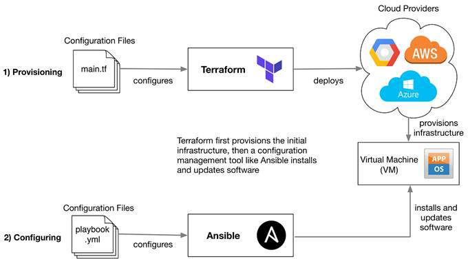

# Infastructure as Code Using Terraform 


# Terraform Orchestration
## What is Terraform?

Orchestration tool, better for setting up network infrastructu and spinning up machines using a cloud service provider
Building infrastructure an a crucial part of creating a system. 
- Itegration testing
- Scripting

## Why Terraform?



Building and updating infrastructure is much easier and quicker

config management - ansible
service orchestration - terraform

Recommended to learn both Terraform and Anisible as companues may prefer one ver the other.
Terraform is a much more simple program to use, and Anisible requires more resources.
Terraform is lightwieght but not agentless
Terraform is an automation tool, (one file can create a VPC, instance, auto-scaling group and load balancer)

## Setting Up Terraform

### Installation of Terraform and Chocolaty

You can download the binary from the following link:
https://www.terraform.io/downloads.html 
When you have unzipped the binary file, there's no installer.

After downloading, you should move the file to `/usr/local/bin` directory and set the Path as an environment variable if necessary.

**For Windows**, install `Chocolaty` and follow the instructions on the page: <br>
https://chocolatey.org/install

We can also install it using chocolatey package managers:
```
Set-ExecutionPolicy Bypass -Scope Process -Force; [System.Net.ServicePointManager]::SecurityProtocol = [System.Net.ServicePointManager]::SecurityProtocol -bor 3072; iex ((New-Object System.Net.WebClient).DownloadString('https://community.chocolatey.org/install.ps1'))
```
Open `PowerShell` in `Admin mode` by right clicking on the application and select **Open as Administrator**

Paste the copied text into your shell and press Enter.

Wait a few seconds for the command to complete.

If you don't see any errors, you are ready to use Chocolatey! Type choco or choco -? now, or see 
Getting Started for usage instructions.

Install Terraform: `choco install terraform`

Check installation: `terraform --version`

Should see below outcome if everything went well:
`Terraform v1.0.?`

<br>

### Main Commands
```bash
Main commands:
  init          Prepare your working directory for other commands
  validate      Check whether the configuration is valid
  plan          Show changes required by the current configuration
  apply         Create or update infrastructure
  destroy       Destroy previously-created infrastructure

All other commands:
  console       Try Terraform expressions at an interactive command prompt
  fmt           Reformat your configuration in the standard style
  force-unlock  Release a stuck lock on the current workspace
  get           Install or upgrade remote Terraform modules
  graph         Generate a Graphviz graph of the steps in an operation
  import        Associate existing infrastructure with a Terraform resource
  login         Obtain and save credentials for a remote host
  logout        Remove locally-stored credentials for a remote host
  output        Show output values from your root module
  providers     Show the providers required for this configuration
  refresh       Update the state to match remote systems
  show          Show the current state or a saved plan
  state         Advanced state management
  taint         Mark a resource instance as not fully functional
  test          Experimental support for module integration testing
  untaint       Remove the 'tainted' state from a resource instance
  version       Show the current Terraform version
  workspace     Workspace management

Global options (use these before the subcommand, if any):
  -chdir=DIR    Switch to a different working directory before executing the
                given subcommand.
  -help         Show this help output, or the help for a specified subcommand.
  -version      An alias for the "version" subcommand.
  ```

## Securing the AWS Keys for Terraform

### Ceating an Env Variable

### 1. 


### 2. 


### 3. 


### 4. 


Repeat these steps for the **AWS_SECRECT_ACCESS_KEY**

## Creating Resources on AWS

### Setting Up App Instance using Terraform

- The two environment variables have just been created
- We now need to restart the terminal
- Create file called main.tf - this is where the EC2 instance will e built
- Add this code to initialise terraform with provider AWS:

```terrform
provider "aws" {

    region = "eu-west-1"
}
```
- Run this code with `terraform init`

Let's start with launching an EC2 instance using the app AMI.
We will need:
- AMI ID
- `sre_key.pem` file
- AWS keys setup is already done
- Public IP
- Type of instance `t2.micro`

Add to the `main.tf` file the information from the AMI:

```terrform
resource "aws_instance" "app_instance" {
    ami = "ami-IDNUMBER"
    instance_type = "t2.micro"
    associate_public_ip_address = true
    tags = {
        Name = "sre_akunma_terraform_app"
    }
}
```
In the terminal, enter `terraform plan` then `terraform apply` to start up the instance.

## Creating and Setting Up a VPC - *Scripting*


(Desciption and context)

<br>

We are creating a new VPC from AWS using Terraform. The steps are nearly identical to the ones in the `AWS_VPC_Networking` repo.

### 1.  Create a VPC with CIDR block
```terrform
resource "aws_vpc" "sre_akunma_vpc_tf" {
    cidr_block = "10.101.0.0/16"
    tags = {
        Name = "sre_akunma_vpc_tf"
    }
}
```

### 2. Run `terraform plan` then `terraform apply` - the VPC should now be running

### 3. Create a `variable.tf` file and place in the VPC ID 
  - Get VPC ID from AWS **or** from terraform logs
```terrform
variable "vpc_id" {
    default = "vpc-IDNUMBER"
}
```

### 4. Create internet gateway and attach the IG to the VPC
```terrform
resource "aws_internet_gateway" "sre_akunma_tf_ig" {
    vpc_id = var.vpc_id
    tags = {
        Name = "sre_akunma_tf_ig"
    }
}
```
  - Create a variable for the internet gateway ID, for future use
```terrform
variable "ig_id" {
    default = "igw-IDNUMBER"
}
```

### 5. Create public subnet for `10.101.1.0/24`:
```terrform
resource "aws_subnet" "sre_akunma_tf_sub" {
    vpc_id = var.vpc_id
    cidr_block = "10.101.1.0/24"
     map_public_ip_on_launch = "true"
    tags = {
        Name = "sre_akunma_tf_sub"
    }
}
```
And make a variable:
```terrform
variable "aws_pub_subnet" {
    default = "subnet-IDNUMBER"
}
```

### 6. Create the route table
```terrform
resource "aws_route_table" "sre_akunma_tf_rt" {
    vpc_id = var.vpc_id
    route = []
    tags = {
        Name = "sre_akunma_tf_rt"
    }
}
```
Edit route and insert your IG
```terrform
resource "aws_route" "r" {
    route_table_id = var.rt_id
    destination_cidr_block = "0.0.0.0/0"
    gateway_id = var.ig_id
}
```
Associate public subnet with route table
```terrform
resource "aws_route_table_association" "pub" {
    subnet_id = var.aws_pub_subnet
    route_table_id = var.rt_id
}
```
Add to `variable.tf` for the route table
```terrform
variable "rt_id"{
    default = "rtb-IDNUMBER"
}
```

### 7. Create a Security Group for our app
```terrform
resource "aws_security_group" "app_group" {
    name = "sre_akunma_tf_sg"
    description = "Security group for app"
    vpc_id = var.vpc_id
    # Inbound rules
    ingress {
        description = "From my IP"
        from_port = 22
        to_port = 22
        protocol = "tcp"
        cidr_blocks = ["YOUR IP"]
    }
    ingress {
        description = "Allow Port 3000"
        from_port = 3000
        to_port = 3000
        protocol = "TCP"
        cidr_blocks = ["0.0.0.0/0"]
    }
    ingress{
        description = "Public Access"
        from_port = 80
        to_port = 80
        protocol = "TCP"
        cidr_blocks = ["0.0.0.0/0"]
        ipv6_cidr_blocks = ["::/0"]
    }
    # Outbound rules
    egress {
        from_port = 0
        to_port = 0
        protocol = "-1"
        cidr_blocks = ["0.0.0.0/0"]
        ipv6_cidr_blocks = ["::/0"]
    }
    tags = {
        Name = "sre_akunma_tf_sg"
    }
}
```
Add this as a variable
```terrform
variable "sg_id" {
    default = "sg-IDNUMBER"
}
```

### 8. In `variable.tf`, add the name and path of the key used to set up the app
```terrform
variable "aws_key_name" {
    default = "NAME"
}

variable "aws_key_path" {
    default = "~/.ssh/NAME.pem"
}
```

### 9. Add code for starting up the EC2 instance in `main.tf`
```terrform
resource "aws_instance" "app_instance" {
    ami = var.webapp_ami_id
    subnet_id = var.aws_pub_subnet
    instance_type = "t2.micro"
    associate_public_ip_address = true
    tags = {
        Name = "sre_akunma_tf_app"
    }
    vpc_security_group_ids = [var.sg_id]
    key_name = var.aws_key_name
    connection {
        type = "ssh"
        user = "ubuntu"
        private_key = var.aws_key_path
        host = "${self.associate_public_ip_address}"
    }
}
```

### After each step, `terraform plan` and `terraform apply` to see the changes exectuted

(The `terraform.tfstate.backup` file can help when looking for an object and its attributes. Rather than using the `variable.tf` file to recall stored values of an object, use `terraform.tfstate.backup` to find out what attributes can be referenced in the code)

## Adding MongoDB to the System

### 1.  Create a private subnet for the DB


### 2. Add new private subnet to route table


### 3. Create a new Security Group for the DB


### 4. Lauch instance


## Load Balancing

(Description and context)

<br>

Add steps in `main.tf` to automate setting up the load balancer and auto-scaling group

**Tasks:**

- create load balancer 
- attach to ig 
- internet faceing 
- listen to port 80 0-65355 3000 
- 22 for ip
- write script for this

### 1. Create a launch configuration

```
resource "aws_launch_configuration" "app_launch_configuration" {
    name = "sre_akunma_tf_lc"
    image_id = var.webapp_ami_id
    instance_type = "t2.micro"
}
```

Make a variable for the `launch_config_name` in `variable.tf`

### 2. Create a load balancer for the application


```
resource "aws_lb" "sre_akunma_tf_lb" {
    name = "sre-akunma-tf-lb"
    internal = false
    load_balancer_type = "application"
    subnets = [
        var.aws_pub_subnet,
        var.aws_priv_subnet
    ]

    tags = {
        Name = "sre_akunma_tf_lb"
    }
}
```
Create a variable for the load balancer ARN

### 3. Create an instance target group

must change the availability zone for the DB priv subnet bc load balacer cant have 2 subnets in same zone: `availability_zone = "eu-west-1b"`

```
resource "aws_lb_target_group" "sre_akunma_tg" {
    name = "sre-akunma-tf-tg"
    port = 80
    protocol = "HTTP"
    vpc_id = var.vpc_id

    tags = {
        Name = "sre_akunma_tf_tg"
    }
}
```

Create a variable for the target group ARN

### 4. Create a listener and a listener group attachment

First, add a variable `target_id` that holds the value for the instance ID.

```
    load_balancer_arn = var.lb_arn
    port = 80
    protocol = "HTTP"

    default_action {
        type = "forward"
        target_group_arn = var.tg_arn
    }
}

resource "aws_lb_target_group_attachment" "sre_akunma_tg_att" {
    target_group_arn = var.tg_arn
    target_id = var.target_id
    port = 80
}
```

### 5. Create an auto-scaling group


```
resource "aws_autoscaling_group" "sre_akunma_ASG_tf" {
    name = "sre_akunma_ASG_tf"

    min_size = 1
    desired_capacity = 1
    max_size = 3

    vpc_zone_identifier = [
        var.aws_pub_subnet,
        var.aws_priv_subnet
    ]

    launch_configuration = var.launch_config_name
}
```

Create a variable for the auto-scaling name you set

### 6. Create an auto-scaling policy

```
resource "aws_autoscaling_policy" "akunma_AS_policy" {
    name = "sre_akunma_AS_policy"
    policy_type = "TargetTrackingScaling"
    estimated_instance_warmup = 100
    autoscaling_group_name = var.AS_name

    target_tracking_configuration {
        predefined_metric_specification {
            predefined_metric_type = "ASGAverageCPUUtilization"
        }
        target_value = 50.0
    }
}
```

## Using the `data` command

(description and context)


### `terraform apply -auto-approve` `terraform destroy target aws_instance.<NAME>`

---

# Performance Testing (rewatch Monday pt 1)

## What is Perfromance Testing and why do we need it?
- ensures system reacts in a timely manner and serves needs
- maps out user experience 
- monitors cpu utilisation
- logs any downtime

**The ultimate goal of testing is to improve the user journey.**
We want to test every single step of the user journey and ensure that there are no obstacles.
- (img of the user journey)

Testing take a long time and is not a single step process 
- (img of iterative process against approach)
The best method is to start small then scale up the testing. It usually takes 6 to 12 weeks to fully test a system, so thorough testing is imperitive.

Testing can simulate *SQL injections* or *DDOS attacks* --> planning for the worst possible outcome. **LINKS**

## How to make an app highly available?
- using multiple avalablity zones
- diffreent regions have different vpcs 
- LOAD BALANCERS

## How to test
There are different types of testing, spike, soak, load and stress testing

- (img of graphs)

## What is a test environment?
It is the environment just before pubublication where you can perform tests that simulate the live app.

**PLAN:**
- performance testing
- load testing
- soak testing
- AWS Jenkins runs tests
- CloudWatch metrics
- use SNS/SQS
- build a job where Jenkins does testing for us

---

## Download and Install Java


https://devwithus.com/install-java-windows-10/

Check Java is installed with `java --version` in th terminal.

## Install IntelliJ and Scala


https://www.jetbrains.com/idea/download/#section=windows

Add Scala plugin

## Download Gatling


https://gatling.io/open-source/#downloadgatling
https://www.blazemeter.com/blog/how-to-install-gatling-on-windows

Keep the gatling folder in the `Program Files` folder within `User`.

### Why Gatling? 
Gatling is used for performance testing and monitoring - it create tests in scala, gatling runs them and makes a series of graphs and charts to narrate how successful the test was.
This is why Gatling is so desirable --> it is an incredibly user-friendly and cohesive system. 

## Instal Maven (for Java)


https://mkyong.com/maven/how-to-install-maven-in-windows/

## Setting Up Performance Testing in Gatling

(**breakdown img/gif**)

Open IntelliJ in **Admin** mode and open a new projects within the Gatling folder.
The application that is provided in this exercise is given by Gatling to help visulaise and test out its functionalities and the interface.

(Gatling file directories
- bin: .bat batch file, .sh shell file
- conf: config for gatling project, recorder records http requests to any server you want to record
- lib: libraries available
- results: results/outcomes from tests after being run
- target: OOP, contains classes
- user files: resources and simlations, records actions requests tests)

1. `cd` into `bin` folder
2. Run `gatling.bat`(For Windows, if you are using a Mac or Linux machine, type in `gatling.sh`). If you have set up the env var and opened IntelliJ as Admin, you should get the response:
```
GATLING_HOME is set to "C:*LOCATION_OF_ENVIRONMENT_VARIABLE*"
JAVA = "java"
```
3. Choose the `computerdatabase.BasicSimulation` operation and enter the number when prompted
4. After `Select run description`, type in whatever name is appropriate --> I used *SRE Akunma Performance Testing* for this session
5. Requests and their outcomes will start to be printed in the terminal
  - Since there have been no changes to the project 
6. In the `results` file, find the file with the name provided in the descirption --> look up `index.html`
7. `index.html` provides a detailed report that we can see in the browser --> copy the **absolute file path** and paste in a browser
This is what you should see: **IMG OF GATLING PAGE W LABELS**
8. In `user-files` --> `simulations` --> `computerdatabase` --> `BasicSimulation` there is a breakdown of the series of tests the project is run with. The information given in index.html is based on these tests.

### *We will do this again, this time selecting an advanced simulation*

1. After running `gatling.bat`, choose the last simulation option prompted which should be titled: `computerdatabase.advanced.AdvancedSimulationStep05`
2. Add a description: *Sparta Advanced Performance Testing*
3. Open up the index page using the `index.html` file located within the selected simulation in the `results` file.
**IMG OF new user-file directory**
4. `user-files` --> `simulations` --> `computerdatabase` --> `advanced`, open the simulation that was just run.

Compare the different environments the two simulations are run in and look at the results that are given. Changing the pause times or the number of users at a time is the best way to test the resilience of the app.

*But how should we decide on the parameters that we measure the system against?* <br>
You can search the average response time for most websites and match it against the response time for own website.

Gtaling provides us with two options: HAR file and HA Proxy

## Running Tests Based on Own Server
(**img of Jenkins main menu**)

1. Go onto your own web server (I am using the Jenkins Project used in ***SRE_Jenkins***)
2. Right-click on the web-page for your server and select `Inspect` (**IMG OF INSPECT POPUP**)
3. Go to `Network` --> there should be no activity
4. Click box to `Peserve log`
5. Click on the clear button on the left and then the recording button beside it
6. Back in IntelliJ, enter the `BasicSimulation` file in the `computerdatabase` folder and change the `.baseurl` code to your server
7. `cd` into `bin` again and run `recoder.bat` (or `recorder.sh` for Mac/Linux). You should see:
```
GATLING_HOME is set to "C:*LOCATION_OF_ENVIRONMENT_VARIABLE*"
JAVA = "java"
```
8. A new window will pop up. (**IMG OF POPUP**)
  - Recorder mode: HAR Converter
  - HAR File: TBD
9. We want to convert data from `recoder.bat` into a HAR file
10. Go back to the webpage of your server with the `Inspect` open --> make activity on page by logging in etc.
11. In `Network`, click the `Export HAR file` button located underneath the `Application` tab
12. Back in the Gatling Recorder window, add the new HAR file that was just recorded
  - Give it an appropriate Class Name (e.g. AkunmaSpartaTest)
  - Leave Output as it is
  - Click `Start` in bottom right corner
13. Go back to `simulations` under `user-files` --> you should find the new Class you just created (**IMG**)
14. You should see  everything that you did on the webpage while it was recorded (including all passwords entered, all pages loaded etc.)
15. Run `gatling.bat` and select the Class you created --> open the `index.html` file in the web browser and see the results

---

## What should we be monitoring about our app?
### Internet Facing vs Internal
Internet facing --> RAM CPU load remaining disk space network load
Network traffic, CPU, etc. Automate reactions to situations

## Autoscaling Policies
The problem with autoscaling is that you will get charged for the max no. of instances that spin up --> there is need for a policy for min/max traffic load.

When creating an autoscaling group we provide a min and max no. of instances. When autoscaling kicks in and new instances spin up for the app. The load balancer attached to IG and VPC then balances node between instances. The load balancer redirectes traffic to active instances so no instance gets overwhelmed.

The autoscaling group automatically adjusts computaional resources when needed to, but it does not automatically reduce the resources, which is why we need to create a policy for this.


**DIAGRAM FOR CW AND AUTOSCALING**
CW triggers event after observing the traffic
this is make sure user doesnt notice change in load
inastnace attached to autoscaling group


**DIAGRAM FOR AUTOMATION W GATLING, AWS, CW, S3, DOCKER, JENKINS**
